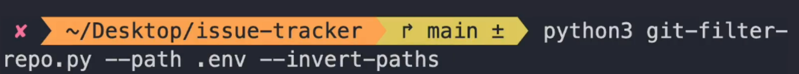

## Tech Stack and packages used
- next.js
- prisma
- classnames 
- zod
- React SimpleMDE (EasyMDE) (Markdown editor)
- react-hook-form
- axios
- react-toastify
- @hookform.resolvers (to integrate react-hook-form with data validation libs including zod)
- react-loading-skeleton
- react-markdown (to preview the markdown) with tailwindcss typography plugin
- react query
- error tracking using sentry

-- usePathname to get current path
-- disabling ssr using next/dynamic

```typescript
 const allowedStatuses = Object.values(Status);
 // getting searchParams
  { searchParams }: { searchParams: Promise<{ status: Status }> }
 ```

 - use git-filter-repo to remove a file from repo history
 